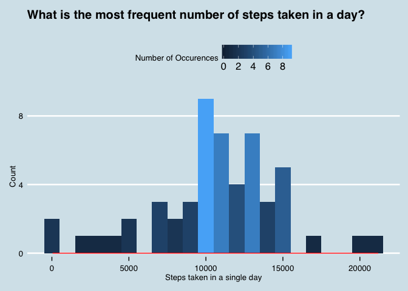

\###################################################################
 Information
###################################################################

*Created by:  <span style ="color :blue"> Linwood Creekmore III  </span> <br>
Started Mar 2016 <br>
For [Johns Hopkins University Data Science Certification](https://www.coursera.org/specializations/jhu-data-science); <span style ="color :red"> Reproducible Research  </span> <br>
Github = https://github.com/linwoodc3 <br>*

### The Purpose of Reproducible Research

Repoducible analysis is all about equipping independent researchers and readers with the tools, data, and analytic code needed to reproduce the results of a study or scientific endeavor. This study uses RMarkdown; read [knitr in a knutshell](http://kbroman.org/knitr_knutshell/) for more information and tricks. In this context, the task explores personal activity monitoring data.  The tools used for plotting and data transformation are imported below.


\###################################################################
 Check for required packages and load 
###################################################################

```{r load_packages, echo=TRUE, warning=FALSE, message=FALSE}
# This block of code checks if the package is installed, and if not, installs it
list.of.packages <- c("dplyr", "tidyr", "RColorBrewer","ggthemes","ggplot2")
new.packages <- list.of.packages[!(list.of.packages %in% installed.packages()[,"Package"])]
if(length(new.packages)) install.packages(new.packages)
```

With all the packages installed, it's time to load them so the current workspace has access to their functionality. <br> 

```{r load_libraries, echo=TRUE, warning=FALSE, message=FALSE}
library(RColorBrewer)
library(dplyr)
library(tidyr)
library(ggthemes)
library(ggplot2)
```

[`RColorBrewer`](http://www.r-bloggers.com/r-using-rcolorbrewer-to-colour-your-figures-in-r/), [`ggplot2`](http://www.r-bloggers.com/ggplot2-2-1-0/), and [`ggthemes`](https://cran.r-project.org/web/packages/ggthemes/vignettes/ggthemes.html) are all used for visualization, while [`dplyr`](https://cran.rstudio.com/web/packages/dplyr/vignettes/introduction.html) and [`tidyr`](http://blog.rstudio.org/2014/07/22/introducing-tidyr/) support data cleaning and transformation.  <br><br>


\###############################################################################
# Looking for locations of files
###############################################################################
 
```{r create_dirs,echo=TRUE}
# This block of code creates directories to store data if it doesn't exist
if (!file.exists('data')) {
        dir.create('data')}
if (!file.exists('./data/files')) {
        dir.create('./data/files')}
```

## Loading and preprocessing the data
This code will check to see if the file exists in the local working directory or workspace, and if not, then [downloads the csv from the source](https://d396qusza40orc.cloudfront.net/repdata%2Fdata%2Factivity.zip) and loads it into a dataframe
called `activity`.

```{r data_load,echo=TRUE,warning=FALSE, message=FALSE}
# downloading the raw zip file and saving as a temporary file or, just passing step if file exists
temp <- tempfile()
if (!file.exists('./data/files/activity.csv')) {
        print(paste0("You did not have the file; downloading.... "))        
        download.file("https://d396qusza40orc.cloudfront.net/repdata%2Fdata%2Factivity.zip",temp)
        unzip(temp,exdir = './data/files')
        print(paste0("You did not have the file; download complete. Proceeding.... "))
} else {
        print(paste0("You have the target zip file. Proceeding.... "))        
}

# Now, read the data into a variable called `activity`
activity <- read.csv('./data/files/activity.csv', sep = ",",na.strings = "NA" )

# Now, use `str` to look at the structure of `activity`
str(activity)
```

## What is mean total number of steps taken per day?
We will use `dplyr` to calculate the mean total number of steps taken per day.  `dplyr` is a great tool to group data and calculate values over these grouped sets.  Below, we use the [chaining](http://www.inside-r.org/packages/cran/dplyr/docs/chain) method of `dplyr` functions to manipulate the `activity` data.

First, calculate the total number of steps taken per day.
```{r total_steps_per_day, echo = TRUE}
per_day <- activity%>%
    na.omit()%>% # removing the na data
    group_by(date)%>%
    summarise(total.steps=sum(steps),
              average.steps = mean(steps))

head(per_day)
```
<br><br>Next we create a histogram using the [`geom_histogram`](http://docs.ggplot2.org/current/geom_histogram.html) function from `ggplot2`.  Note, we are also using the Economist theme from `ggthemes` to create a polished look.  <br><br>
```{r historgram_plot, echo=FALSE, message=FALSE,warning=FALSE}
g <- ggplot(per_day,aes(total.steps))
g + geom_histogram(binwidth = 1000, aes(fill=..count..))+
        theme_economist()+
        stat_function(fun = dnorm, colour = "red")+
        scale_y_continuous(breaks=c(0,4,8,12))+
        scale_fill_continuous(guide_legend(title.position="right",title='Number of Occurences'),
                           breaks = seq(0,10,by=2),
                           labels = seq(0,10,by=2))+
        scale_colour_economist()+
        labs(x="Steps taken in a single day",y="Count",
             title="What is the most frequent number of steps taken in a day?")
```


With an understanding of frequently occuring values, let's look at the overall mean and median of the *total number* of steps taken per day (e.g. over the entire data set).

```{r mean_n_median, echo=TRUE,warnings=FALSE,message=FALSE}
# The mean
print(paste0(mean(per_day$total.steps)))

# The median
print(paste0(median(per_day$total.steps)))
```
<br><br>

## What is the average daily activity pattern?
The next exercise is to create a time series plot that looks at the average number of steps taken 5-minute intervals across all days. Again, we use `dplyr` to index and select the correct data.  
```{r interval_data, echo=TRUE,warnings=FALSE,message=FALSE}
interval_activity <- activity%>%
    na.omit()%>% # removing the na data
    group_by(interval)%>%
    summarise(average.steps = mean(steps))
```

With the data selected, the next ste is to make a time series plot and make the busiest interval stand out.  

```{r max_interval, echo=TRUE,warnings=FALSE,message=FALSE}
l <- ggplot(interval_activity,aes(x=interval,y=average.steps))
l + geom_line(aes(colour=average.steps))+
scale_x_continuous(breaks=seq(0,2500,by=250))+
theme_economist()+
geom_text(aes(label=ifelse(interval_activity$average.steps == max(interval_activity$average.steps),
                           as.numeric(interval_activity$interval),'')))+
        labs(x="5 minute intervals",y="Average Steps",
             title="What is the busiest 5-minute interval?")
```


```{r max_print, echo=TRUE}
print(paste0("The 5-minute interval with the maximum average steps is ",
interval_activity$interval[interval_activity$average.steps == max(interval_activity$average.steps)]))
```

## Imputing missing values
The next step in the analysis is to calculate and report the total number of missing values in the data set.  
```{r NA_sum, echo=TRUE}
# The total number of NAs in the dataset.
sum(is.na(activity))
```
Just to be sure, let's see if the `NA` is confined to one column or spread across.  We need to get a final number of `2304` if the missing data is spread over the columns.

```{r NA_columns, echo=TRUE}
# Test for NAs over columns.
sapply(activity,function(x) sum(is.na(x)))
```
Good!  The `NA`s are confined to the `steps` column.  What percentage is missing?

```{r NA_percentage, echo=TRUE}
# Percentage of NA columns in steps.
sum(is.na(activity$steps))/length(activity$steps)*100
```
13%.  Not bad!.  Let's replace the missing numbers with the mean and create a new `filled_activity` dataset.

```{r NA_replace, echo=TRUE}
new_activity <- activity%>%
    group_by(interval)%>%
    mutate(steps = ifelse(is.na(steps),mean(steps,na.rm=TRUE),steps))
    


filled_activity <- new_activity%>%
    group_by(date)%>%
    summarise(total.steps=sum(steps),
              average.steps = mean(steps))


    
    
head(filled_activity)
```

A quick histogram of the new filled data.
```{r filled_plot, echo=TRUE}
g <- ggplot(filled_activity,aes(total.steps))
g + geom_histogram(binwidth = 1000, aes(fill=..count..))+
        theme_economist()+
        stat_function(fun = dnorm, colour = "red")+
        scale_y_continuous(breaks=c(0,4,8,12))+
        scale_fill_continuous(guide_legend(title.position="right",title='Number of Occurences'),
                           breaks = seq(0,10,by=2),
                           labels = seq(0,10,by=2))+
        scale_colour_economist()+
        labs(x="Steps taken in a single day",y="Count",
             title="Filled: What is the most frequent number of steps taken in a day?")
```

Here is the mean and median.
```{r filled_mean_n_median, echo=TRUE,warnings=FALSE,message=FALSE}
# The mean
print(paste0(mean(filled_activity$total.steps)))

# The median
print(paste0(median(filled_activity$total.steps)))
```
The mean and median changed slighly but not much in terms of the total magnitude.  The mean is pretty much the same.  The impact is that the histogram values are higher for the 
## Are there differences in activity patterns between weekdays and weekends?
Understanding the difference in weekday and weekend patterns means we must convert our dates to representations of days of the week, and then classify them into weekend and weekday factors. A great walkthrough was on stackoverflow, [converting weekdays to week and weekend factors.](from stackoverflow http://stackoverflow.com/questions/28893193/creating-factor-variables-weekend-and-weekday-from-date) 

```{r factors, echo=TRUE}

new_activity$date <- as.Date(new_activity$date)
weekdays1 <- c('Monday',"Tuesday","Wednesday","Thursday","Friday")
new_activity$wDay <- c('weekend','weekday')[(weekdays(new_activity$date) %in% weekdays1)+ 1L]
head(new_activity)
```

Let's check the factors

```{r factor_check, echo=TRUE}
weekdays(new_activity$date[6])
filled_interval_activity <- new_activity%>%
    group_by(interval,wDay)%>%
    summarise(average.steps = mean(steps))
head(filled_interval_activity)
```

Now to the final step, the plot comparing the average number of steps averaged across all weekends and weekdays in a time series plot of 5-minute intervales. We are just adding a [`facet_grid`](http://docs.ggplot2.org/current/facet_grid.html) based on the newly created `wDay` column.  

```{r final_plot, echo=TRUE}
m <- ggplot(filled_interval_activity,aes(x=interval,y=average.steps, fill=wDay))
m + geom_line(aes(colour=wDay)) +
        facet_grid(.~wDay)+ scale_fill_brewer(palette = "Paired")+theme_economist()+labs(x="5 minute intervals",y="Average Steps",
             title="Weekend vs. Week: What is the busiest 5-minute interval?")
```